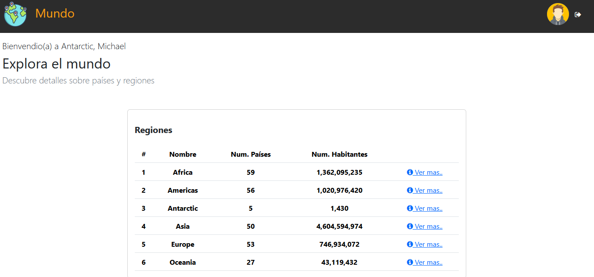
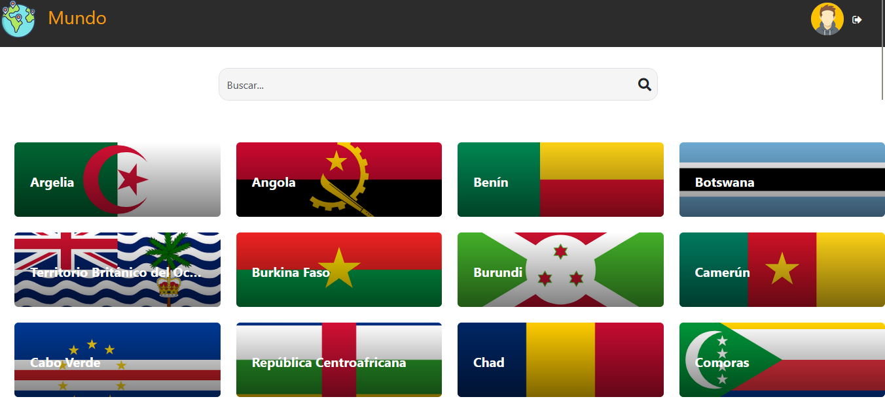
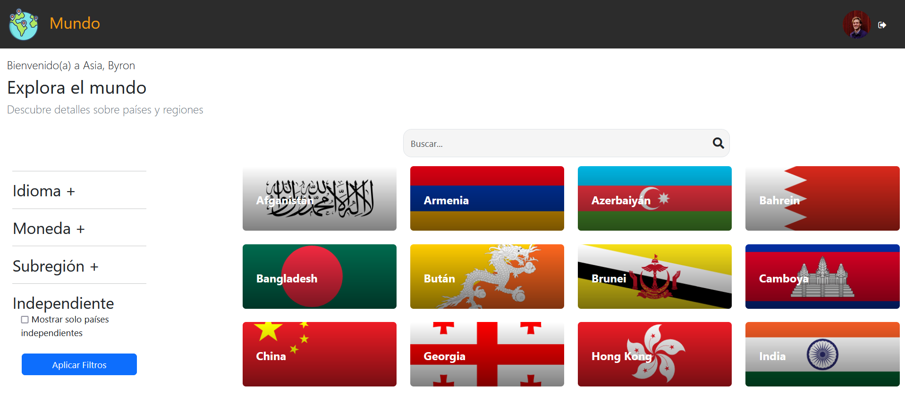
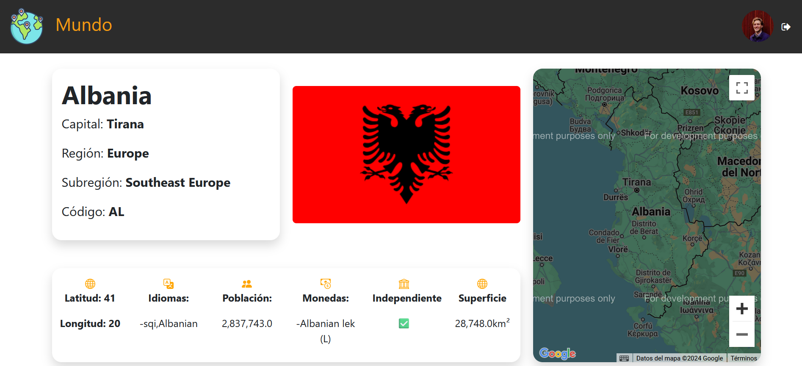

# CountryApp 

### Descripción

Esta aplicación web proporciona una plataforma interactiva para gestionar y visualizar información sobre países y regiones del mundo. Permite a los administradores tener una vista completa de los datos disponibles, mientras que los usuarios pueden explorar información de países en función de sus preferencias geográficas.

## Objetivo

- Permitir la gestión de datos de países para diferentes tipos de usuarios. .
- Proporcionar herramientas de búsqueda y filtrado para una experiencia de usuario optimizada.
- Facilitar el acceso a información geográfica de forma organizada.

## Instalación
Para instalar mi proyecto, sigue estos pasos:

1. Clona el repositorio con `git clone https://github.com/tu_usuario/mi_proyecto.git`
2. Instala las dependencias con `npm install`
3. Inicia la aplicación con `npm start`

## ng version

Angular CLI: 12.1.0

Node: 14.16.0

Package Manager: npm 6.14.15

OS: linux x64

  

Angular:

...

  

Package Version

------------------------------------------------------

@angular-devkit/architect 0.1200.5

@angular-devkit/core 12.0.5

@angular-devkit/schematics 12.0.5

@schematics/angular 12.0.5

## Dependencias utilizadas

- "@angular/animations": "18.2.0",
- "@angular/common": "8.2.0",
-  "@angular/compiler": "18.2.0",
-   "@angular/core": "18.2.0",
-  "@angular/forms": "18.2.0",
-  "@angular/google-maps": "18.2.6",
-   "@angular/platform-browser": "18.2.0",
-   "@angular/platform-browser-dynamic": "18.2.0",
-   "@angular/router": "18.2.0",
-   "bootstrap": "5.3.3",
-   "ngx-cookie-service": "18.0.0",
-   "ngx-toastr": "19.0.0",
-   "roboto-fontface": "0.10.0",
-   "rxjs": "7.8.0",
-   "tslib": "2.3.0",
-   "zone.js": "0.14.10"

## Características Principales 

### Tipos de Cuenta

1. **Administrador**
   - Acceso a todas las funcionalidades, incluyendo:
     - Nombres de los continentes.
     - Cantidad total de países por continente.
     - Número total de habitantes de cada país y continente.
     - Visualización completa de todos los países y su información.

    

     
#

 2. **Usuario**
 - Los usuarios tienen un acceso restringido, permitiéndoles: 
    - Visualización de todos los países en la región que se encuentra. 
    - Filtrado de bubúsqueda 

 - Filtros de Búsqueda:  
    - Por Idioma: Buscar países que hablan un idioma específico.  
    - Por Moneda: Filtrar países según la moneda que utilizan. 
    - Por Subregión: Buscar países dentro de subregiones definidas.  
    - Independencia: Mostrar solo países independientes.  
    - Buscador: Una barra de búsqueda para encontrar un país específico

##

### Detalles del País

Al seleccionar un país, se mostrará una vista detallada con la siguiente información:

- **Coordenadas**: Latitud y longitud del país, permitiendo su localización en un mapa.
- **Idiomas**: Idiomas oficiales y hablados en el país.
- **Población**: Número total de habitantes.
- **Moneda**: Tipo de moneda utilizada y su símbolo.
- **Independencia**: Estado de independencia del país (independiente o no).
- **Superficie**: Área total en kilómetros cuadrados.
- **Capital**: Ciudad capital del país.
- **Región y Subregión**: Información sobre la región y subregión geográfica a la que pertenece el país.
- **Código**: Código internacional del país.

### Mapa de Ubicación

Incluye un mapa interactivo que muestra la ubicación del país seleccionado, utilizando [Google Maps API] para una mejor visualización geográfica.

## Versionamiento
- v1.0.0 - Creación de proyecto bpm-apn y creación de libreria adquiriencia.

